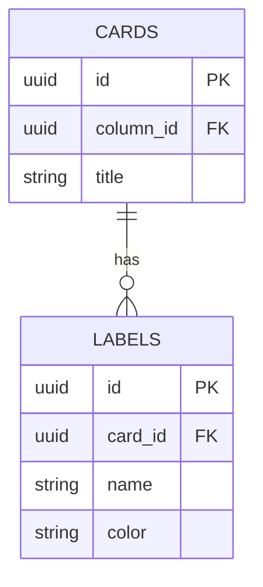
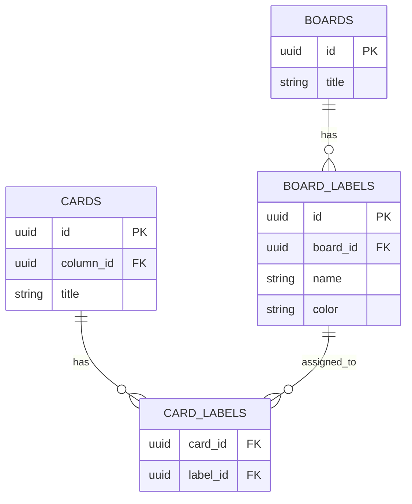
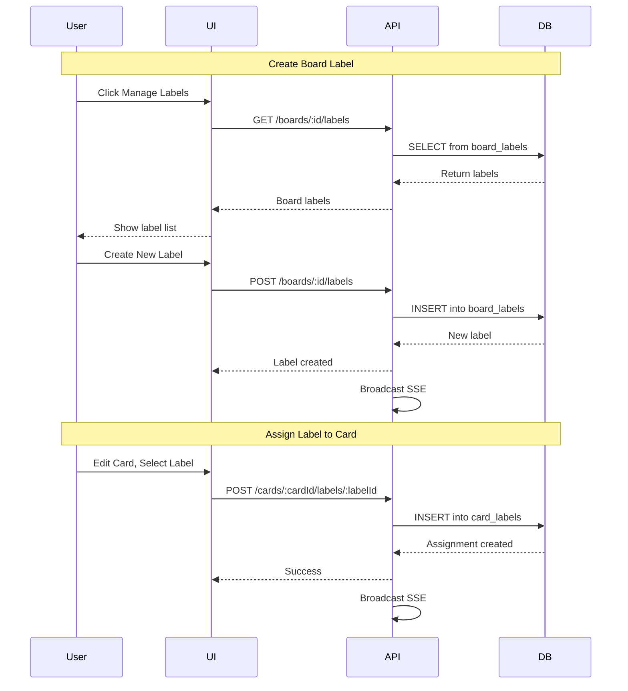
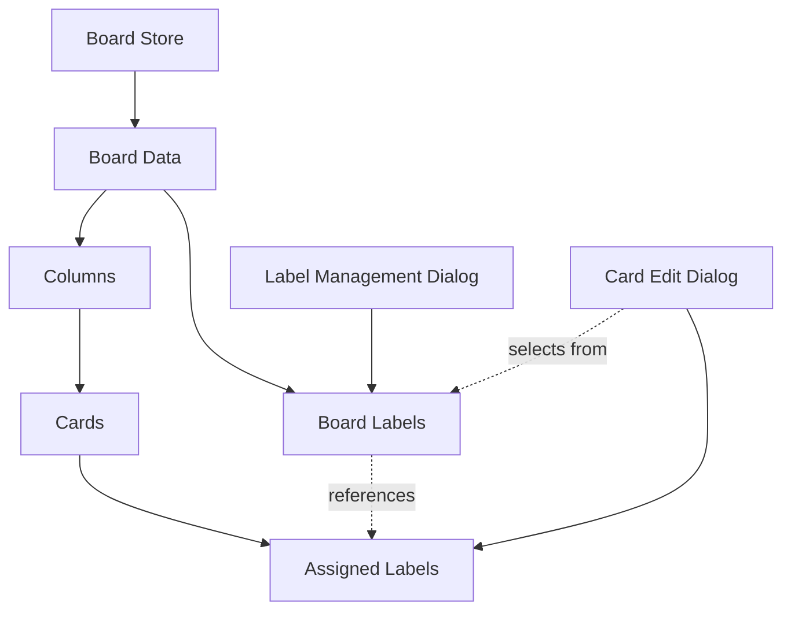

# Board-Level Labels System Design

## Overview

This document outlines the architectural design for migrating from card-level labels to board-level labels in Fluxboard. The new system will allow users to create a library of reusable labels at the board level and assign them to cards as needed.

## Current System Analysis

### Database Schema (Current)
```sql
-- labels table
CREATE TABLE labels (
    id UUID PRIMARY KEY,
    card_id UUID NOT NULL REFERENCES cards(id) ON DELETE CASCADE,
    name VARCHAR(255) NOT NULL,
    color VARCHAR(50) NOT NULL,
    created_at TIMESTAMPTZ NOT NULL DEFAULT NOW()
);
CREATE INDEX idx_labels_card_id ON labels(card_id);
```

**Issues with current design:**
- Labels are tied directly to cards via `card_id`
- Duplicate labels (same name + color) exist across multiple cards
- No central management of labels
- Cannot reuse labels across cards

### Current API Endpoints
- `POST /cards/:cardId/labels` - Create label for a card
- `PUT /labels/:labelId` - Update label
- `DELETE /labels/:labelId` - Delete label

## New System Design

### Database Schema Changes

We'll implement a **many-to-many relationship** between labels and cards using a junction table:

```sql
-- Step 1: Create new labels table (board-level)
CREATE TABLE board_labels (
    id UUID PRIMARY KEY DEFAULT gen_random_uuid(),
    board_id UUID NOT NULL REFERENCES boards(id) ON DELETE CASCADE,
    name VARCHAR(255) NOT NULL,
    color VARCHAR(50) NOT NULL,
    created_at TIMESTAMPTZ NOT NULL DEFAULT NOW(),
    updated_at TIMESTAMPTZ NOT NULL DEFAULT NOW(),
    UNIQUE(board_id, name, color)  -- Prevent duplicate labels on same board
);

CREATE INDEX idx_board_labels_board_id ON board_labels(board_id);

-- Step 2: Create junction table for card-label assignments
CREATE TABLE card_labels (
    card_id UUID NOT NULL REFERENCES cards(id) ON DELETE CASCADE,
    label_id UUID NOT NULL REFERENCES board_labels(id) ON DELETE CASCADE,
    created_at TIMESTAMPTZ NOT NULL DEFAULT NOW(),
    PRIMARY KEY (card_id, label_id)
);

CREATE INDEX idx_card_labels_card_id ON card_labels(card_id);
CREATE INDEX idx_card_labels_label_id ON card_labels(label_id);
```

### Data Migration Strategy

The migration will:
1. Create new `board_labels` and `card_labels` tables
2. Migrate existing label data from `labels` table
3. Merge duplicate labels (same name + color on same board)
4. Maintain all card-label relationships
5. Drop old `labels` table

**Migration Logic:**
```sql
-- For each board:
--   1. Get all labels for cards in that board
--   2. Group by (name, color) to find duplicates
--   3. Create one board_label for each unique (name, color) pair
--   4. Create card_labels entries linking cards to board_labels
--   5. Handle labels with same name but different color separately
```

### New API Endpoints

#### Board Label Management
```
GET    /boards/:boardId/labels          - List all labels for a board
POST   /boards/:boardId/labels          - Create a new board label
PUT    /boards/labels/:labelId          - Update a board label
DELETE /boards/labels/:labelId          - Delete a board label
```

#### Card Label Assignment
```
POST   /cards/:cardId/labels/:labelId   - Assign label to card
DELETE /cards/:cardId/labels/:labelId   - Unassign label from card
```

### Backend Models

#### New/Updated Models

**BoardLabel** (new model - replaces Label)
```rust
pub struct BoardLabel {
    pub id: Uuid,
    pub board_id: Uuid,
    pub name: String,
    pub color: String,
    pub created_at: DateTime<Utc>,
    pub updated_at: DateTime<Utc>,
}
```

**CardLabel** (new junction table model)
```rust
pub struct CardLabel {
    pub card_id: Uuid,
    pub label_id: Uuid,
    pub created_at: DateTime<Utc>,
}
```

**Updated Board Response**
```rust
pub struct BoardWithRelations {
    // ... existing fields
    pub columns: Vec<ColumnWithCards>,
    pub labels: Vec<BoardLabel>,  // NEW: Include board labels
}
```

### Frontend Type Changes

**Updated Types:**
```typescript
// New board-level label
export interface BoardLabel {
  id: string;
  board_id: string;
  name: string;
  color: string;
  created_at: string;
  updated_at: string;
}

// Updated Board type
export interface Board {
  // ... existing fields
  labels?: BoardLabel[];  // NEW
}

// Card keeps reference to labels (for display)
export interface Card {
  // ... existing fields
  labels?: BoardLabel[];  // Now references board labels
}
```

### SSE Events

New events to support real-time updates:

```typescript
// Board label events
BoardLabelCreated { label: BoardLabel }
BoardLabelUpdated { label: BoardLabel }
BoardLabelDeleted { label_id: Uuid }

// Card label assignment events
CardLabelAssigned { card_id: Uuid, label: BoardLabel }
CardLabelUnassigned { card_id: Uuid, label_id: Uuid }
```

## UI/UX Design

### Board Label Management Dialog

New dialog accessible from board header:

**Features:**
- List all board labels
- Create new labels (name + color picker)
- Edit existing labels (name/color)
- Delete labels (with confirmation)
- Shows count of cards using each label

**Location:** 
- Button in board header: "Manage Labels" or label icon
- Opens a dialog/popover

### Card Label Assignment (Edit Card Dialog)

Updated "Manage Labels" section in edit card dialog:

**Behavior:**
- Display all available board labels as selectable chips
- Show which labels are currently assigned (highlighted/checked)
- Click to assign/unassign labels to the card
- No manual label creation - all labels come from board level

**Visual Design:**
```
Labels
─────────────────────────────────
Available Labels:
[✓ High Priority] [✓ Bug] [ Feature] [ Design]
[ Documentation] [ Testing] [ Backend] [ Frontend]

Click to assign/unassign labels
```

### Migration UX

The migration happens transparently via database migration:
- No user action required
- Existing labels automatically converted
- Duplicates merged automatically
- All assignments preserved

## Implementation Phases

### Phase 1: Database & Backend Core (2-3 tasks)
1. Create migration file with schema changes + data migration
2. Update backend models (BoardLabel, CardLabel)
3. Update backend services (LabelService → BoardLabelService)

### Phase 2: Backend API (2-3 tasks)
4. Implement new board label endpoints
5. Implement card label assignment endpoints
6. Add SSE events for label operations

### Phase 3: Frontend Core (3-4 tasks)
7. Update TypeScript types
8. Update board store to handle board labels
9. Update API client functions
10. Update use-board hook

### Phase 4: UI Components (3-4 tasks)
11. Create Board Label Management Dialog
12. Add button to board header
13. Update Edit Card Dialog for label assignment
14. Update card display to show labels correctly

### Phase 5: Testing & Documentation (2 tasks)
15. Test migration with sample data
16. Update documentation

## Database Migration File Structure

```sql
-- Migration: board_labels_system
-- Description: Convert card-level labels to board-level labels with junction table

BEGIN;

-- Step 1: Create new tables
CREATE TABLE board_labels (...);
CREATE TABLE card_labels (...);

-- Step 2: Migrate data
WITH board_card_labels AS (
  -- Get all labels with their board context
  SELECT DISTINCT
    l.id as old_label_id,
    l.name,
    l.color,
    l.card_id,
    col.board_id,
    c.id as card_id_ref
  FROM labels l
  JOIN cards c ON l.card_id = c.id
  JOIN columns col ON c.column_id = col.id
),
unique_board_labels AS (
  -- Create unique board labels (merge duplicates)
  INSERT INTO board_labels (board_id, name, color)
  SELECT DISTINCT board_id, name, color
  FROM board_card_labels
  RETURNING id, board_id, name, color
)
-- Create card-label assignments
INSERT INTO card_labels (card_id, label_id)
SELECT DISTINCT
  bcl.card_id,
  ubl.id
FROM board_card_labels bcl
JOIN unique_board_labels ubl ON 
  bcl.board_id = ubl.board_id AND
  bcl.name = ubl.name AND
  bcl.color = ubl.color;

-- Step 3: Drop old table
DROP TABLE labels;

COMMIT;
```

## Mermaid Diagrams

### Current System Architecture



### New System Architecture



### Data Flow - Creating and Assigning Labels



### State Management Flow



## Key Considerations

### Performance
- Junction table is indexed for fast lookups
- SSE events keep clients in sync
- Frontend stores board labels separately from cards

### Data Integrity
- CASCADE deletes ensure cleanup
- UNIQUE constraint prevents duplicate board labels
- Junction table enforces referential integrity

### Backward Compatibility
- Migration is one-way (old labels table is dropped)
- API endpoints change completely
- Frontend must be updated simultaneously with backend

### Future Enhancements
- Label templates/presets
- Label categories/groups
- Label usage analytics
- Bulk label operations

## Testing Strategy

### Migration Testing
1. Create test data with various label scenarios:
   - Cards with same labels (name + color)
   - Cards with similar labels (same name, different color)
   - Cards with unique labels
   - Boards with no labels
2. Run migration
3. Verify:
   - All labels converted to board labels
   - Duplicates merged correctly
   - All card assignments preserved
   - No data loss

### API Testing
- Test CRUD operations for board labels
- Test assignment/unassignment of labels to cards
- Test SSE events broadcast correctly
- Test error cases (deleting label in use, etc.)

### UI Testing
- Test label management dialog
- Test card label assignment
- Test real-time updates via SSE
- Test error handling and loading states

## Rollout Plan

1. Deploy backend with migration (off-peak hours recommended)
2. Migration runs automatically on startup
3. Deploy frontend simultaneously
4. Monitor for errors
5. Validate label functionality
6. Announce feature to users

## Success Criteria

- All existing labels migrated successfully
- No duplicate labels per board (same name + color)
- Users can manage labels at board level
- Users can assign/unassign labels to cards
- Real-time updates work correctly
- Performance is acceptable (no noticeable slowdown)